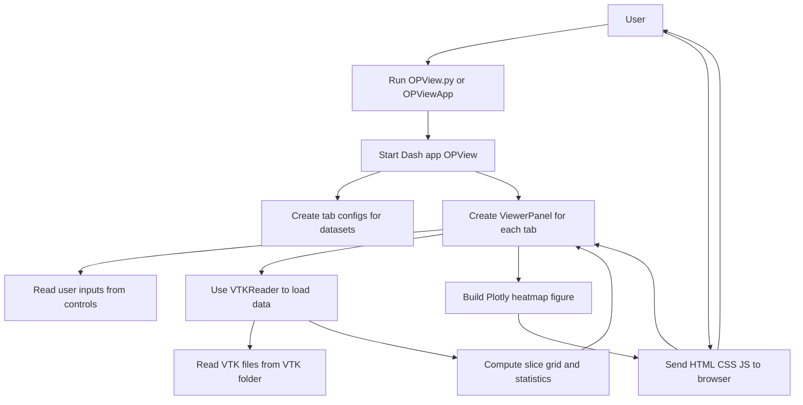

# Tech Stack

This project is a VTK slice viewer built with Python and Dash, visualizing VTK data in a web browser.

## Stack overview

- Language / runtime: Python 3.12-3.13 (CPython)
- Frontend (browser): HTML / CSS / JS generated by Dash
- Web framework / UI: dash, dash-mantine-components, plotly
- Data and numerics: numpy, scipy, pyvista, vtk
- Other libraries: markdown, kaleido
- Data sources: VTK files (e.g. VTK/*.vts) and legacy TextData/*.txt

## Dependencies (requirements.txt)

- dash
- dash-mantine-components
- plotly
- numpy
- scipy
- pyvista
- vtk
- markdown
- kaleido

## Architecture notes

- Legacy entry point: OPView.py builds layout, registers callbacks, and uses module globals.
- Preferred entry point: app/OPViewApp initializes AppContext and DataManager, then injects them into OPView.py for compatibility.
- AppContext (app/context.py): centralized state (projects, caches, data sources).
- DataManager and DataSource classes (data/): OOP sources plus legacy TextData loaders.
- UIManager and UI components (ui/): card builders and layout assembly used by OPView.py wrappers.
- CallbackManager and sub-managers (callbacks/): group and register callbacks by feature.
- ViewerPanel and ViewerState (viewer/): VTK viewer panel and viewer state.
- ComparisonManager and helpers (comparisonmgr/): comparison tab UI, callbacks, and utilities.

## Flowchart

