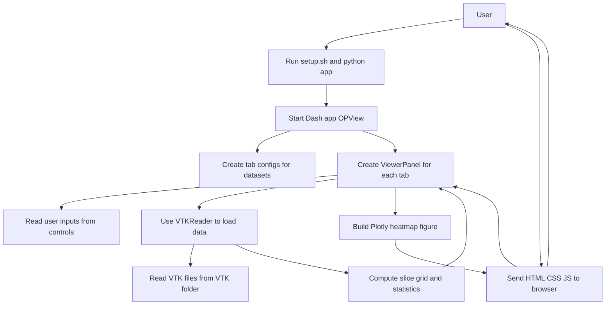

# Tech Stack

This project is a VTK 2D slice viewer built with Python and Dash, visualising VTK data in a web browser.

## Stack overview

- **Language / runtime:** Python 3.12–3.13 (CPython)
- **Frontend (browser):** HTML / CSS / JS generated by Dash
- **Web framework / UI:** `dash`, `dash-mantine-components`, `plotly`
- **Data & numerics:** `numpy`, `scipy`, `pyvista`, `vtk`
- **Other libraries:** `markdown`, `kaleido`
- **Data source:** VTK files (e.g. `VTK/*.vts`)

## Flowchart

